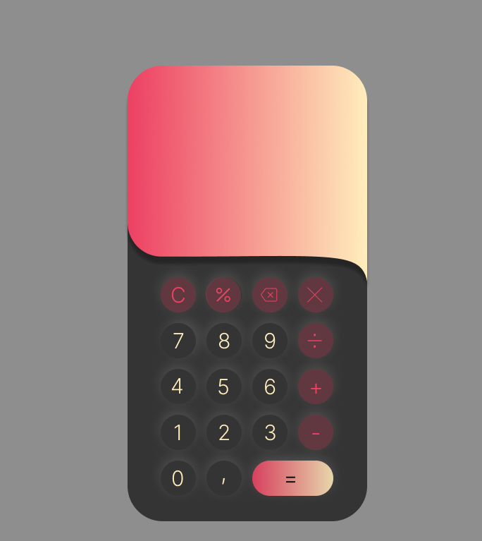

# New design for calculator project

This is the original project: https://github.com/Mashha/calculator

It was the first major project where I needed to implement more logic after already making some simple projects like RPS game and Etch a sketch.   

I got an idea for a new design and made it in figma. I also made an SVG in figma and implemented it in the CSS. I experimented with different colors and have decided for this combination at the end. This is the first time i made my own svg and have learned a little bit more about how to use them. 

Live version: https://calculator-project-pimu.netlify.app/

